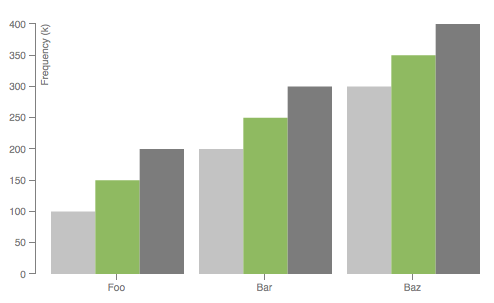
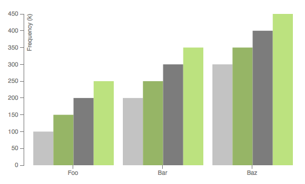

# D3 Dynamic Grouped Bar Chart

[D3.js](http://d3js.org/) grouped bar chart implementation that provides a wrapper for rendering rectangles and scales dynamically based on the data passed to it. This can be plugged in with ease on any existing application. The chart can be modified dynamically by simply adding/removing values to the data. This is a very straightforward implementation.

## Usage

Include `d3.js`, `chart.js` and `chart.css` in your html file, as in `index.html`. Assuming an element with ID `#statChart` (see `index.html`), executing:

```js
// Initialise the graph
var chart = new Chart(500, 300, "#statChart");

// Create some data
var chartData = [
		{name: 'Foo', value: [{"a":100}, {"b":150}, {"c":200}]}, 
		{name: 'Bar', value: [{"a":200}, {"b":250}, {"c":300}]}, 
		{name: 'Baz', value: [{"a":300}, {"b":350}, {"c":400}]}
		];	
						      
// Render the chart with chartData
Chart.render(chartData, chart);
```
will produce the following chart:



Changing the data and re-rendering the graph:

```js
// Change the data - add an extra column to each group
chartData = [
	{name: 'Foo', value: [{"a":100}, {"b":150}, {"c":200}, {"d":250}]}, 
	{name: 'Bar', value: [{"a":200}, {"b":250}, {"c":300}, {"d":350}]}, 
	{name: 'Baz', value: [{"a":300}, {"b":350}, {"c":400}, {"d":450}]}
	];	
						      
// Re-render the chart
Chart.render(chartData, chart);
```

will update the chart to the following:



# License

MIT
